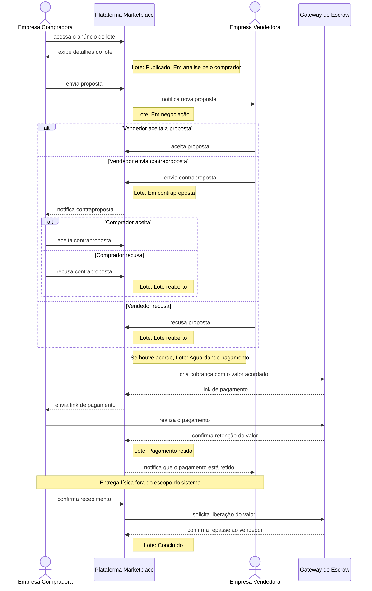

# Sequência: negociação e pagamento em garantia (escrow)

```mermaid
sequenceDiagram
    actor C as Empresa Compradora
    participant P as Plataforma Marketplace
    actor V as Empresa Vendedora
    participant G as Gateway de Escrow

    C->>P: acessa o anúncio do lote
    P-->>C: exibe detalhes do lote
    Note right of P: Lote: Publicado, Em análise pelo comprador

    C->>P: envia proposta
    P-->>V: notifica nova proposta
    Note right of P: Lote: Em negociação

    alt Vendedor aceita a proposta
        V->>P: aceita proposta
    else Vendedor envia contraproposta
        V->>P: envia contraproposta
        Note right of P: Lote: Em contraproposta
        P-->>C: notifica contraproposta
        alt Comprador aceita
            C->>P: aceita contraproposta
        else Comprador recusa
            C->>P: recusa contraproposta
            Note right of P: Lote: Lote reaberto
        end
    else Vendedor recusa
        V->>P: recusa proposta
        Note right of P: Lote: Lote reaberto
    end

    Note right of P: Se houve acordo, Lote: Aguardando pagamento
    P->>G: cria cobrança com o valor acordado
    G-->>P: link de pagamento
    P-->>C: envia link de pagamento
    C->>G: realiza o pagamento
    G-->>P: confirma retenção do valor
    Note right of P: Lote: Pagamento retido
    P-->>V: notifica que o pagamento está retido

    Note over V,C: Entrega física fora do escopo do sistema

    C->>P: confirma recebimento
    P->>G: solicita liberação do valor
    G-->>P: confirma repasse ao vendedor
    Note right of P: Lote: Concluído
```