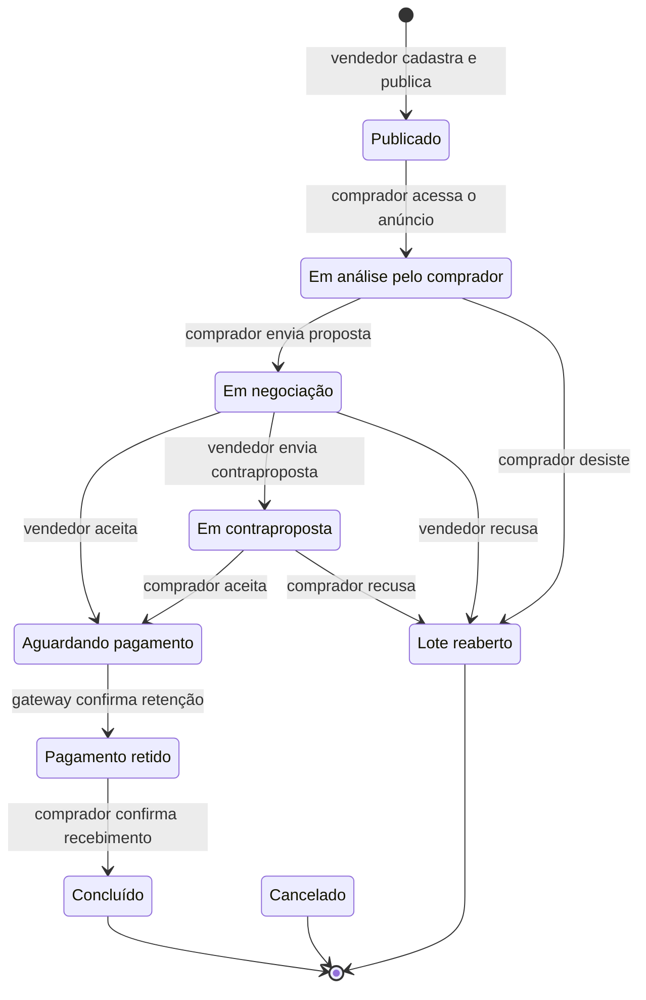

# Ciclo de vida do LoteResiduo

```mermaid
stateDiagram-v2
    direction TB

    Publicado : Publicado
    EmAnalise : Em análise pelo comprador
    EmNegociacao : Em negociação
    EmContraproposta : Em contraproposta
    AguardandoPagamento : Aguardando pagamento
    PagamentoRetido : Pagamento retido
    LoteReaberto : Lote reaberto
    Concluido : Concluído

    [*] --> Publicado : vendedor cadastra e publica
    Publicado --> EmAnalise : comprador acessa o anúncio

    EmAnalise --> EmNegociacao : comprador envia proposta
    EmAnalise --> LoteReaberto : comprador desiste

    EmNegociacao --> AguardandoPagamento : vendedor aceita
    EmNegociacao --> EmContraproposta : vendedor envia contraproposta
    EmNegociacao --> LoteReaberto : vendedor recusa

    EmContraproposta --> AguardandoPagamento : comprador aceita
    EmContraproposta --> LoteReaberto : comprador recusa

    AguardandoPagamento --> PagamentoRetido : gateway confirma retenção

    PagamentoRetido --> Concluido : comprador confirma recebimento

    LoteReaberto --> [*]
    Concluido --> [*]
    Cancelado --> [*]
```